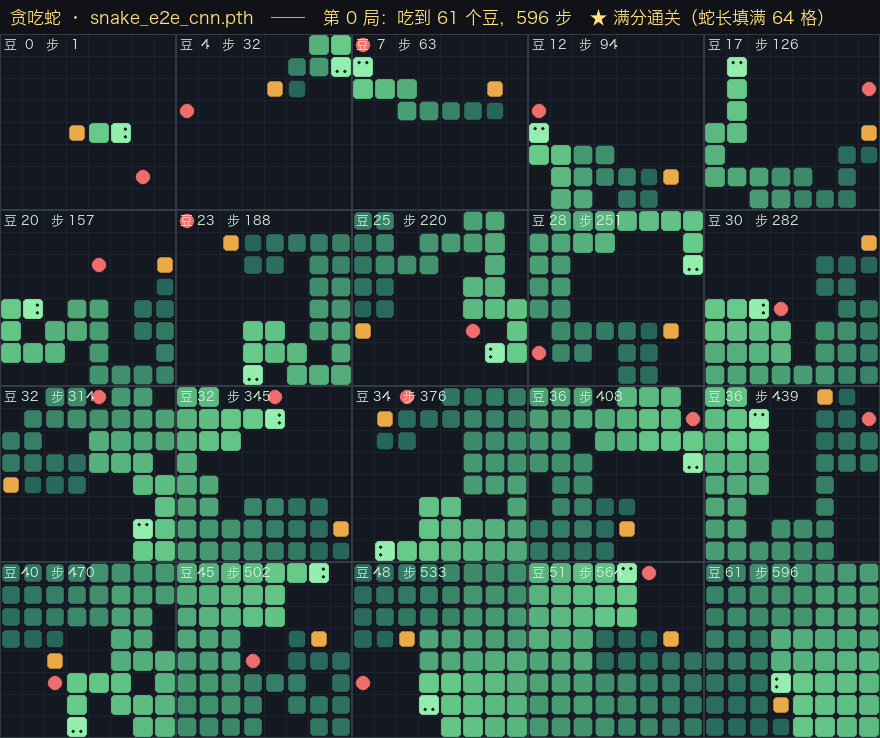

## 00 问题

最近学习强化学习，就想到了不如用一个游戏来加深强化学习里的知识，所以就想到贪吃蛇。

**任务**：玩贪吃蛇，8×8 的棋盘。

**目标**：**不告诉它规则。** 不写「前面是墙就转弯」，也不写「朝豆子走」。
只有一个分数 —— 吃到豆 **+1**，撞死或饿死 **−1**。

**过程**：不停训练，直接收敛成一个稳定的策略。

| | 是什么 | 说明 |
| --- | --- | --- |
| **状态** | 那 8×8 个格子 | 蛇在哪、豆在哪、朝哪边 |
| **动作** | 只有三个 | 左转 / 直行 / 右转 |
| **奖励** | +1 或 −1 | 吃到豆，或者死掉 |

## 01 三种方案

一开始，让 AI 做了一份贪吃蛇的游戏，可以人手去玩，同时可以通过 API 拿到游戏状态和奖励。
在此基础上想了三个方案来训练：

### 特征量 + MLP

把棋盘上的信息写成 18 个数字喂进去。这 18 个数字分成两半：

**6 个是直接从棋盘读出来的**（不用计算）：

| | 是什么 |
| --- | --- |
| 食物在前还是在后 | 相对蛇头朝向 |
| 食物在左还是在右 | 同上，跟着朝向旋转 |
| 食物有多远 | 曼哈顿距离 |
| 有多饿 | 距离上次吃到豆走了多少步 |
| 蛇有多长 | 当前节数 |
| 头离尾巴多远 | 曼哈顿距离 |

**12 个是人写程序算出来的规则** —— 4 组 × 3 个动作，每组都在问「如果我走这个动作，会怎样」：

| | 问的问题 | 怎么算 |
| --- | --- | --- |
| 危险码 | 走这一步会立刻死吗 | 只看前面一格 |
| flood fill | 走完这一步，还剩多少空格可去 | 走一步 + 数连通块 |
| 2 步前瞻 | 走完再走一步，最差还剩多少 | 走两步 + 数连通块 |
| 蛇尾可达 | 走完这一步，还追得到自己的尾巴吗 | 走一步 + 找路 |

**等于把规则和答案先替它算好**，它只要学「看到什么数，该往哪边转」。

### 纯 CNN 卷积网络

不给特征，给 4 张 8×8 的图：蛇身、蛇头、豆子、还剩多久饿死。用卷积网络接。

用**卷积网络**，就是因为卷积能保留「哪个格子在哪个位置」这个信息 —— 它拿一个小窗口在图上滑动，
等于告诉网络「相邻的格子是相关的」。

### 纯 MLP

和 **CNN** 的训练方法一致，仅仅是把模型换成了纯的 MLP。

同样 4 张图，但**拉平成一串 256 个数**再喂进去。信息一个没少，**位置没了**。

## 02 结果

三种方案都训练了 **400 轮 × 32 局 = 12,800 局**，但花的时间和力气差很多：

| 方案 | 训练局数 | 训练步数 | 训练耗时 | 模型大小 |
| --- | --- | --- | --- | --- |
| ① 特征量 + MLP | 12,800 | 794 万 | **39 分钟** | **38 K** |
| ② 纯 CNN | 12,800 | 431 万 | 3.3 小时 | 153 K |
| ③ 纯 MLP | 12,800 | 391 万 | 10 分钟 | 99 K |

> **耗时那列别直接比。** ② 跑在 GPU 上，①③ 跑在 CPU 上。换算到同一硬件，② 要 5~6 小时。

测试是 50 局、固定种子，所以三种方案面对的是**同一批局面**。

| 方案 | 平均豆 | 打满的局 | 没打满时平均拿多少 | 最差的一局 |
| --- | --- | --- | --- | --- |
| ① 特征量 + MLP | **59.1** | 34 / 50 | **55.1** | 37 |
| ② 纯 CNN | 50.8 | 32 / 50 | 32.7 | 2 |
| ③ 纯 MLP | 33.2 | 0 / 50 | 33.2 | 2 |

先看「打满的局」：① 和 ② 差不多，68% 对 64%，只差两局。
很容易得出「不给人工特征也行」—— **但这是错的。** 差别在最后两列。

> **上限一样，差别在下限。**
>
> ① 没打满也能拿 55 个豆，差一点点。② 没打满只有 33，最差的一局吃了 2 个豆就死了。

**结果：**

1. 特征量 + MLP 和 纯 CNN，都可以完成任务；纯 MLP 暂时没有看到完成的机会。
2. 特征量 + MLP 和 纯 CNN 虽然都能完成，但它们是有差异的。

## 03 三个问题

### Q1 为什么纯 MLP 上不去？

**因为它没有位置信息。**

同样一个「1」，在向量第 5 位和在向量第 40 位，对网络来说是两个无关的数。
它得为 64 个位置各学一遍。

它不是学不到 —— 33 个豆，远高于随机（0.16）和手写规则 AI（17.8）。
**它是上不去**：50 局一局没打满。

### Q2 为什么纯 CNN 反而行？

**因为结构对了。**

棋盘本来就是二维格子，相邻的格子互相影响。卷积的先验正好对上这个对象。

它一个手工特征都没有，中位数却是满分，满分率和 ① 只差两局。

> **它内部还自己长出了人算过的东西。** 把网络冻住去读它中间层的 128 个数，
> 「还剩多少空格」「追不追得到尾巴」这两个读出来的准确度有 0.95~0.97 ——
> 没人告诉过它「连通块」是什么。把那两个方向抹掉，它就从 50.8 崩到 20 出头。

### Q3 为什么 CNN 能打满分，平均分还低 8 个豆？

**因为差别在下限，不在上限。**

打满的局数差不多（34 对 32）。没打满的那些局，① 还能拿 55，② 只有 33。

① 拿到的是 3 个干净的数字；② 自己长出来的是一团纠缠在 128 维里的东西。
大多数时候判断一致，偶尔看走眼。

## 04 结论

- **把人想明白的算好喂进去：模型小、学得快、下限高。** 代价是换个任务要重来一遍。
- **给对结构，网络能自己学出来。** 纯 CNN 没有手工特征，中位数照样满分。
- **结构给错就上不去。** 拉平扔了位置信息，满分率从 64% 掉到 0%。

> 数字来源：三种方案用的是同一套 PPO、同一个奖励、同一张棋盘、同样 400 轮训练。
> 成绩都是终测 50 局、每步取概率最大的动作、固定种子。

---

8×8 贪吃蛇，相对动作（左转 / 直行 / 右转），奖励 = 吃到豆 +1、撞死或饿死 −1。
